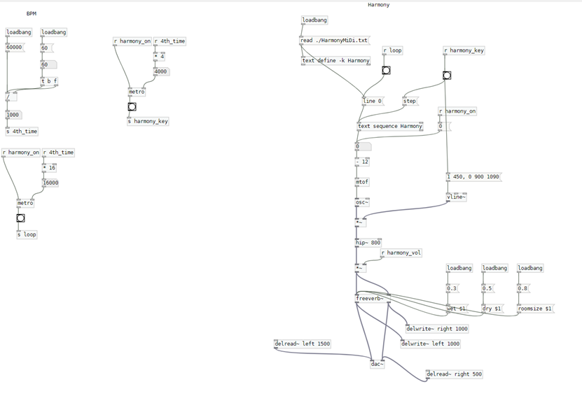

# Parts of my performance
This music tells a story of a satellite which lost connection with earth wandered in the space. During its lonely journey, it encountered magnificent cosmic sights and attempted to communicate with aliens after recieving their friendly signals. 

To transform the notes into MIDI number, I used python to write a function.

1. Bass
   In this part, I wrote 4 four main chords (B-A-G-A)(other parts of the music are based on these 4 main chords) 
   
   Here I used the abstraction to hide the synthersizer in the synth.PD file. I used `vline~` to make the fade in and fade out effect of each chord;

   I used `sel` object to let each chord proceed in a certain order;

   To create a sense of airy and space, Here I used the `freeverb~` to achieve this sound effect.
   

    
   

2. Chords Progression
   I wrote all the MIDI numbers in a ChordsMiDi.txt file. I used `text define` to stored all the MIDI numbers and `text sequence` as a message sender to send the MIDI number. `mtof` was used to transform the MIDI number into frequency.

   In this part, I designed a subtractive synthesizer. I used `lop~` to to make each note sound more rounded and muffled.

   Here, I also used `freeverb~` to create a sense of airy and space.
   

   
    
   

3. Lead
   This part is designed to simulate   the friendly signal from aliens. 

   Like the chords progression part, I also used `text define` and `text sequence` to store and send MIDI number.`mtof` was used to transform the MIDI number into frequency.

   In addition, I used `hip~` to filter the noise and make the lead part sound clear.

   

   
    
   

4. Harmony
   This part is designed to simulate the signals that was sent by the satellite to communicate with the aliens.

   Like the chords progression part, I also used `text define` and `text sequence` to store and send MIDI number.`mtof` was used to transform the MIDI number into frequency.

   Besides, I also used the combination of `delwrite` and `delread~` to create a sense of sound echoing in the universe.
   

   
    
   

5. Percussion
   In this part, to make the beat soft and slow, I chose 2 kinds of timbre to simulate the beat one is salt shaker sound, the other is tambourine. 

   To make the hit of tambourine sound more natural and airy. `vline~` was used to create the fade in and fade out sound effect. Besides, `freeverb~` was used to create reverb effect.

   

   
    
   

6. Crash Cymbal
   In this part, I used an array to store the crash cymbal sound sample and used `tabplay~` to read and play this sound sample.
   
   To make this sample sound more naturally, I used `vline~` to create a fade in and fade out sound effect.
   

   
    
   

7. User Interface
    Here I used 5 toggles to control the following 5 channels, which from left to right are bass, chords, lead, harmony and beat, with 5 vsliders to control the volume of them. In addition, I used a bang to control the cymbal. All the operations are stored in Interface.PD file.

    

   
    
   

8. BPM
   I use a BPM algorythm to realize the BPM. Here I set the tempo into 60 and it will send 4th_time signal to make different notes.

   Then I used additive sythesizer to create 4th_note, whole_note and subtractive sythesizer to create 8th_note.
   

   
    
   

# How to perform this piece
All the operations are included in the Interface.PD file.

In order to perform this music properly, you need to align all channels with their corresponding chord positions manualy. 

After that you can perform this piece with any combination of all the channels you wish to by adjusting the volume of each channel.

# References
1. Eponn. 2019. Sci fi reverse 1 Proceesed. Retrieved from<https://freesound.org/people/Eponn/sounds/493974/> 
2. Reverse Cymbals. 2014. Retrieved from<https://freesound.org/people/JarredGibb/sounds/244835/>
3. Salt Shaker sound. Ash_Contreras. 2020. Retrieved from<https://freesound.org/people/Ash_Contreras/sounds/535394/>
4. Charles Martin. Introduction to Computer Music. 2023. Retrieved from<https://github.com/cpmpercussion/ComputerMusicIntro/tree/master/7-synth-design/karplus-strong-example>
5. Sound Simulator. 2021. How to Create Generative Ambient Music in Pure Data! Retrieved from <https://www.youtube.com/watch?v=fgkUChwL2B4&list=PLyFkFo29zHvD4eRftIAjcLqIXCtSo7w8g&index=11>
6. Piano Lessons On The Web. Your First Music Composition Lesson - For Beginners. 2016. Retrieved from<https://www.youtube.com/watch?v=Cdk6-joiTug>